# GRU-vs-LSTM-comparison-for-Reinforcement-Learning-using-Blackjack-game
In this work I study blackjack as a partially observable environment in Gymnasium.

In the game, the agent starts with 2 cards and the dealer starts with one card face up. The goal of the agent in order to win is to request new cards or stay with those it has in order to have the sum of all cards equal to 21. The A can take value 1 or 11, and K, Q, and J are equal to 10. The dealer also draws cards and will try to have a greater value than the player inside the range of 21 in order to make the agent lose.

The environment is partially observable as:

1. The agent does not know which is the next card if he draws one.
2. The agent does not know which is the next card if the dealer draws one.
3. The agent does not know if A is counted as 1 or 11 at the end of his turn.

The observation structure is the following:

1. The current sum of values of cards of the agent.
2. The value of the first card of the dealer.
3. Whether the agent has a playable ace or not.

## LSTM

After the initial analysis, I implemented the LSTM by defining the `ActorCriticLSTM` architecture, the discounted reward return

$$
G_t = \sum_{k=0}^{T-t-1} \gamma^{k} r_{t+k},
$$

the training process, and the evaluation process.

### Architecture

The architecture of the Actor-Critic LSTM consists of a 3-dimensional state vector where the input is `(player sum, dealer showing, usable ace)`, hidden layers, and layers. When the number of layers is greater than one, it is a stacked LSTM. The model processes inputs in batches.

At the last step, the observations are summarized. We use the ReLU activation function to produce non-linearity. Lastly, we use an Actor head to produce stochastic policies and a Critic head to evaluate the state value.

### Training

For each episode we train, we reset the environment and process the input through a forward pass of our defined model, where the policies, critic value estimation, and memory for the next step are defined.

After that, action selection takes place and the environment transitions to the next state. After each episode, we calculate advantage estimation in order to find out whether an action was worse or better than expected, calculate actor and critic losses, sum them, and update the parameters.

### Evaluation

After the training is completed, we evaluate our model. First, we set our model to evaluation mode and disable gradients in order not to train and to save memory and computing power.

Afterwards, we evaluate for a number of episodes. We reset the environment, perform a forward pass, select an action greedily, and change the environment while summing the rewards. At the end, we obtain the average rewards of all runs and the win rate.

## GRU

For GRU, we have a similar architecture with a Critic and an Actor head, stacking GRUs that process information in batches using hidden layers and layers.

## Initial Evaluation

In the initial evaluation we performed, we found that GRU is performing a little better than LSTM.

## LSTM

For hyperparameter tuning, we first tried it by hand with the following configuration:

| Configuration                         | Layers | Hidden Size | Avg Reward | Win Rate (%) |
| ------------------------------------- | -----: | ----------: | ---------: | -----------: |
| Deep LSTM, $\gamma=0.99$              |      2 |         128 |    -0.1748 |        38.64 |
| Shallow LSTM, $\gamma=0.99$, lr=0.001 |      1 |         512 |    -0.1756 |        38.78 |
| Shallow LSTM, $\gamma=0.99$           |      1 |         128 |    -0.1774 |        38.62 |
| Shallow LSTM, $\gamma=0.95$           |      1 |         128 |    -0.1778 |        38.76 |
| Shallow LSTM, $\gamma=0.99$           |      1 |         512 |    -0.1928 |        38.20 |
| Shallow LSTM, $\gamma=0.99$           |      1 |         256 |    -0.2098 |        37.38 |

**Table: Performance comparison of Actor-Critic LSTM configurations on Blackjack**

The results show that the best model is the deep one with 2 layers, but it is not too far from the other models. All win rates take values from 37% to 39%.

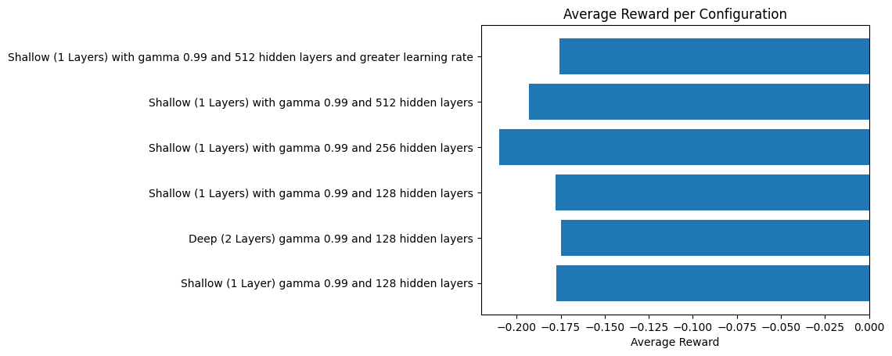

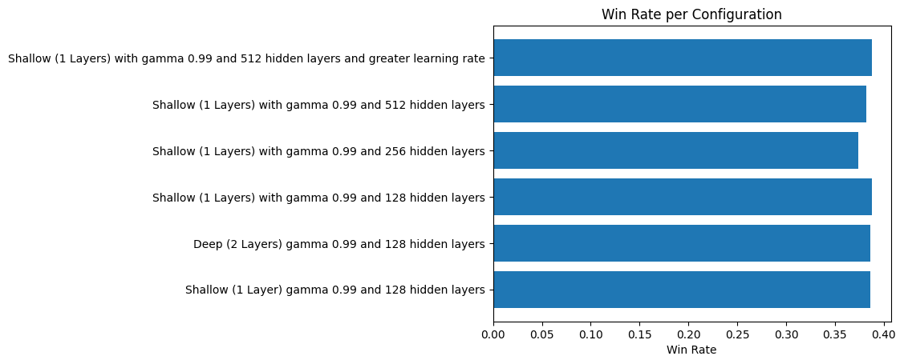

After the hand try, we used Optuna to automatically find the best hyperparameters. The results of the trials can be seen in the following table.

As we can see, the best hyperparameters are:

* $LR = 1.58 \times 10^{-4}$
* `Hidden = 256`
* `Layers = 3`
* $\gamma = 0.905$

The 3-layer model outperforms all the others, and gamma should be set lower than 0.95 as we set by hand. Furthermore, we have to keep learning rates at small values.

| Trial |      LR | Hidden | Layers | $\gamma$ | Win Rate (%) |
| ----: | ------: | -----: | -----: | -------: | -----------: |
|     0 | 0.00285 |    512 |      1 |    0.982 |        38.70 |
|     1 | 0.00031 |    512 |      3 |    0.994 |        40.10 |
|     2 | 0.00109 |    256 |      1 |    0.928 |        40.00 |
|     4 | 0.00016 |    256 |      3 |    0.945 |        42.00 |
|     5 | 0.00016 |    256 |      3 |    0.905 |    **42.90** |
|    13 | 0.00025 |    256 |      3 |    0.928 |        41.65 |
|    17 | 0.00015 |    256 |      3 |    0.915 |        41.45 |
|    23 | 0.00016 |    256 |      3 |    0.917 |        42.20 |
|    25 | 0.00016 |    256 |      3 |    0.919 |        42.40 |
|    29 | 0.00031 |    512 |      3 |    0.934 |        41.55 |

**Table: Selected Optuna trials for Actor-Critic LSTM hyperparameter tuning on Blackjack**

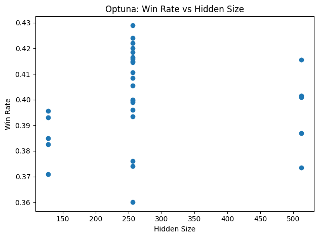

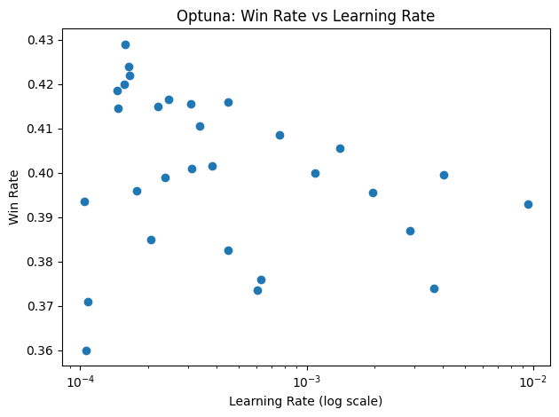

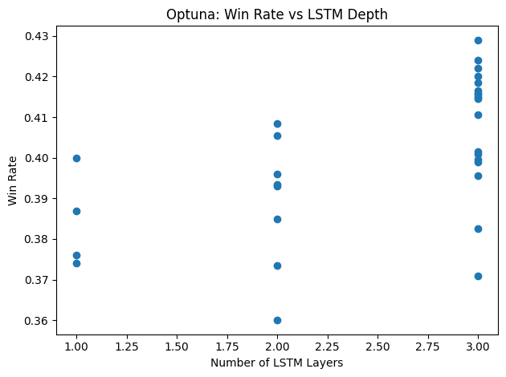

## GRU

We took the same approach with GRU Actor-Critic, where we first tuned the hyperparameters by hand. The results show again that the deep model with 2 layers performs better, with win rates ranging from 38% to 41%.

| Model         | GRU Layers | Hidden Size | Win Rate (%) | Avg. Reward |
| ------------- | ---------: | ----------: | -----------: | ----------: |
| Shallow GRU   |          1 |         128 |         38.1 |      -0.186 |
| Deep GRU      |          2 |         128 |     **40.3** |      -0.134 |
| Wide GRU      |          1 |         256 |        ~39.0 |      ~-0.17 |
| Very Wide GRU |          1 |         512 |        ~38.0 |      ~-0.18 |

**Table: Performance comparison of Actor-Critic GRU architectures. Results are averaged over training episodes; wide-model results exhibit higher variance and no consistent improvement.**

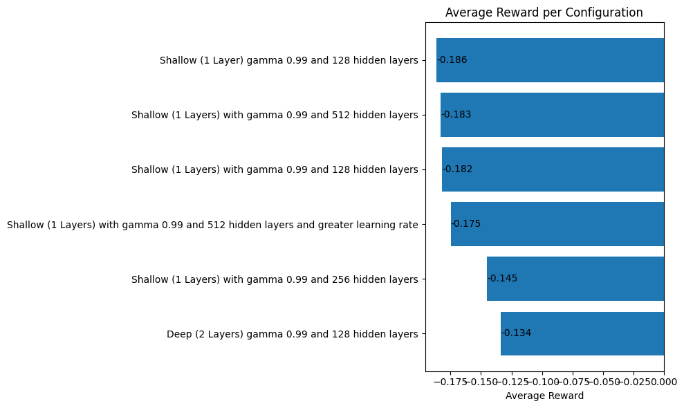

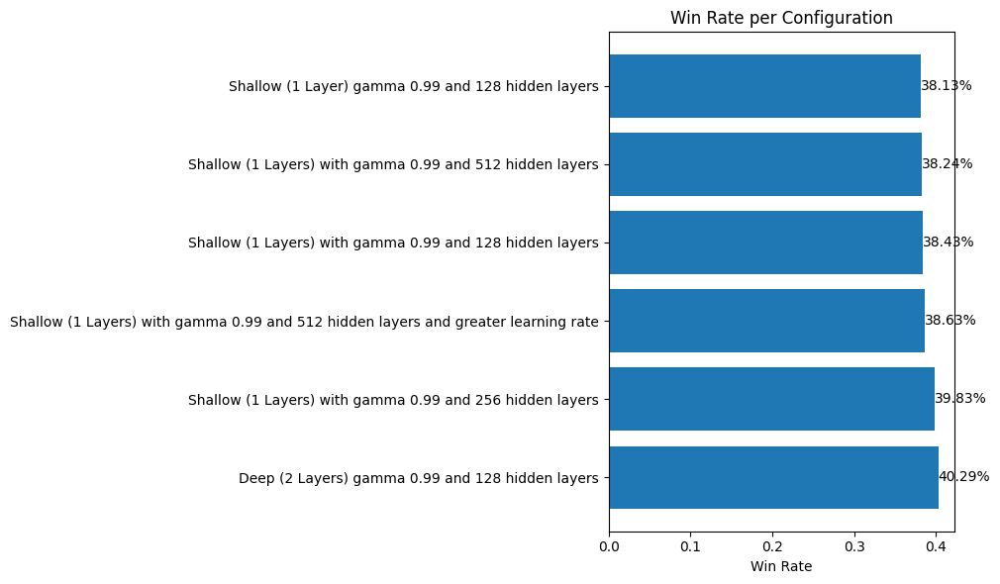

After that, we performed Optuna hyperparameter tuning.

| Metric / Hyperparameter    |                 Value |
| -------------------------- | --------------------: |
| Win Rate                   |                0.4390 |
| Learning Rate ($lr$)       | $4.78 \times 10^{-4}$ |
| Hidden Size                |                   128 |
| GRU Layers                 |                     3 |
| Discount Factor ($\gamma$) |                0.9156 |

**Table: Best Optuna trial results for Actor-Critic GRU hyperparameter search.**

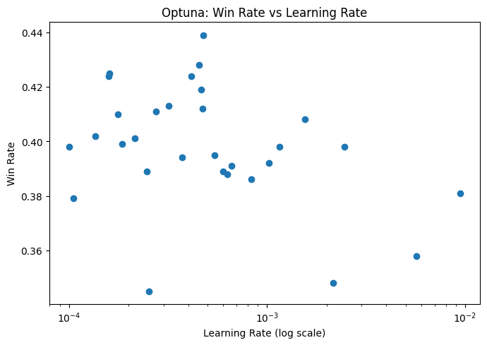

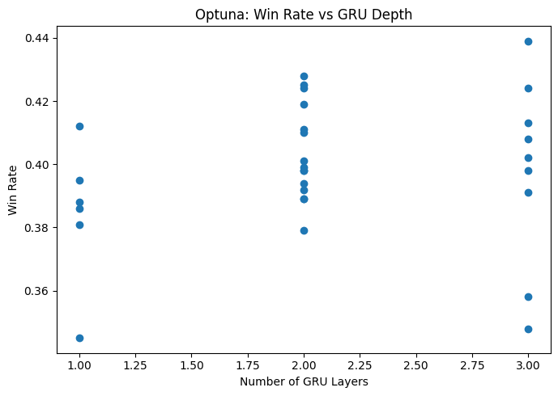

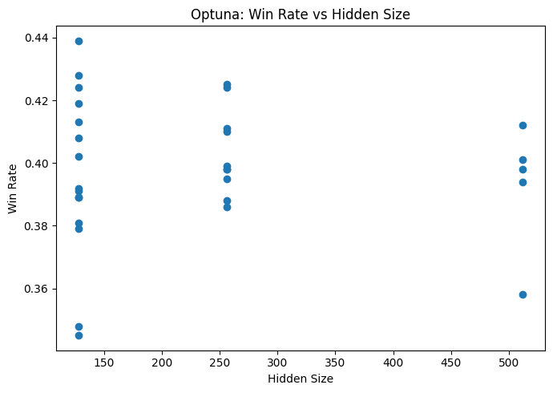

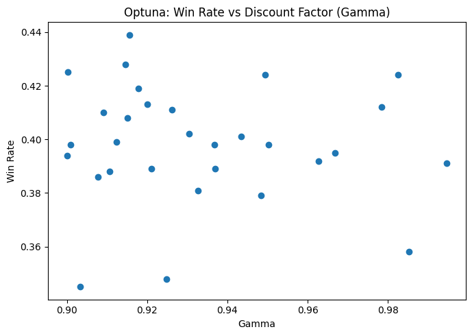

## Discussion of Results

After the by-hand hyperparameter tuning and the Optuna optimizations, we found out that GRU performs better.

## LSTM

After that, we did feature extraction first. We performed the same hyperparameter tuning by hand with the following results.

| Configuration                         | Layers | Hidden Size |  Avg Reward | Win Rate (%) |
| ------------------------------------- | -----: | ----------: | ----------: | -----------: |
| Shallow LSTM, $\gamma=0.99$           |      1 |         128 |     -0.2150 |        36.80 |
| Deep LSTM, $\gamma=0.99$              |      2 |         128 | **-0.1050** |    **42.00** |
| Shallow LSTM, $\gamma=0.99$           |      1 |         128 |     -0.1500 |        39.70 |
| Shallow LSTM, $\gamma=0.99$           |      1 |         256 |     -0.1630 |        39.70 |
| Shallow LSTM, $\gamma=0.99$           |      1 |         512 |     -0.1850 |        38.90 |
| Shallow LSTM, $\gamma=0.99$, lr=0.001 |      1 |         512 |     -0.1750 |        38.80 |

**Table: Evaluation performance of Actor-Critic LSTM models with feature extraction first on Blackjack (1000 episodes)**

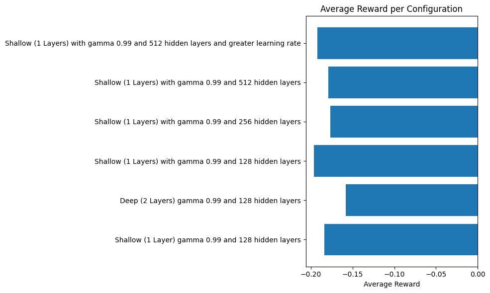

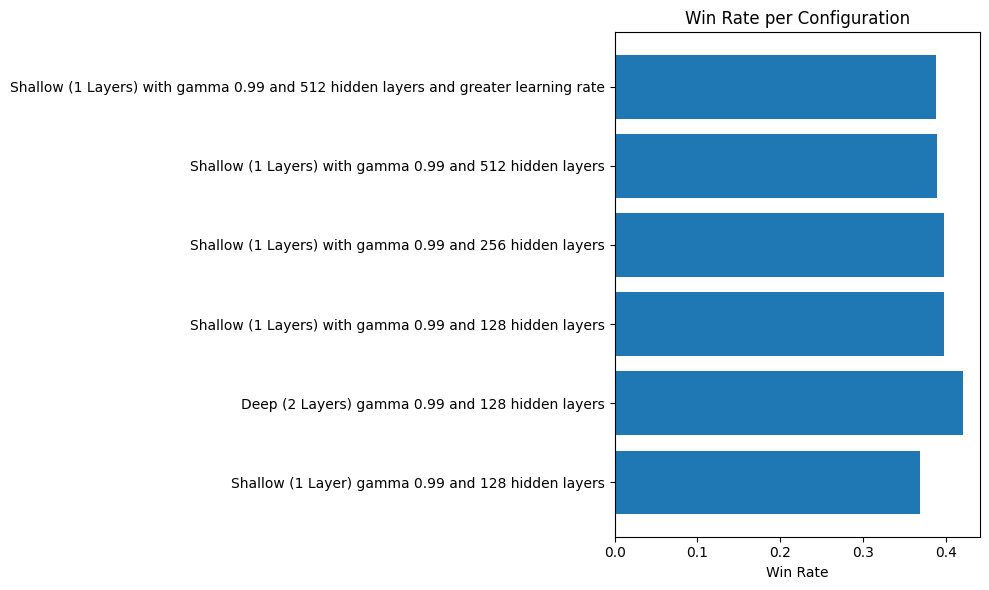

Here we can observe that we get slightly better win rates and average rewards because the model can now exploit the structure more efficiently.

Our next step in evaluation was the use of Optuna for hyperparameter tuning.

| Trial |          LR |  Hidden | Layers |  $\gamma$ | Win Rate (%) |
| ----: | ----------: | ------: | -----: | --------: | -----------: |
|     0 |     1.83e-4 |     128 |      1 |     0.902 |        38.60 |
|     1 |     8.56e-3 |     512 |      2 |     0.992 |        40.25 |
|     2 |     6.02e-3 |     256 |      2 |     0.975 |        37.75 |
|     3 |     2.02e-4 |     256 |      1 |     0.997 |        38.30 |
|     4 |     4.75e-3 |     128 |      3 |     0.927 |        37.70 |
|     5 |     1.48e-4 |     512 |      1 |     0.947 |        38.85 |
|     6 | **1.91e-4** | **128** |  **3** | **0.973** |    **41.45** |
|     7 |     5.21e-4 |     128 |      1 |     0.936 |        38.25 |
|     8 |     4.16e-4 |     128 |      2 |     0.923 |        40.30 |
|     9 |     6.73e-3 |     512 |      2 |     0.940 |        38.75 |
|    10 |     1.62e-3 |     128 |      3 |     0.966 |        39.75 |
|    11 |     5.01e-4 |     128 |      3 |     0.912 |        38.30 |
|    12 |     4.27e-4 |     128 |      3 |     0.962 |        39.45 |
|    13 |     1.32e-3 |     128 |      2 |     0.925 |        39.15 |
|    14 |     1.05e-4 |     128 |      2 |     0.979 |        41.10 |
|    15 |     1.12e-4 |     256 |      3 |     0.982 |        40.25 |
|    16 |     2.63e-4 |     128 |      2 |     0.960 |        37.40 |
|    17 |     1.02e-4 |     128 |      2 |     0.983 |        40.70 |
|    18 |     2.60e-3 |     512 |      3 |     0.971 |        38.50 |
|    19 |     7.23e-4 |     256 |      3 |     0.952 |        37.70 |
|    20 |     2.97e-4 |     128 |      2 |     0.985 |        38.60 |
|    21 |     1.01e-4 |     128 |      2 |     0.979 |        40.35 |
|    22 |     1.42e-4 |     128 |      2 |     0.988 |        39.45 |
|    23 |     2.67e-4 |     128 |      2 |     0.998 |        40.95 |
|    24 |     2.45e-4 |     128 |      2 |     0.999 |        38.55 |
|    25 |     3.49e-4 |     128 |      1 |     0.971 |        37.10 |
|    26 |     7.70e-4 |     128 |      3 |     0.989 |        39.70 |
|    27 |     1.65e-4 |     128 |      2 |     0.958 |        39.75 |
|    28 |     2.21e-4 |     256 |      2 |     0.994 |        37.65 |
|    29 |     1.67e-4 |     512 |      1 |     0.977 |        38.25 |

**Table: Optuna hyperparameter tuning results for Actor-Critic LSTM on Blackjack (2000 evaluation episodes per trial). The best-performing configuration is highlighted.**

From this, we can infer that the best hyperparameters are:

* $LR = 1.9 \times 10^{-4}$
* `Hidden = 128`
* `Layers = 3`
* $\gamma = 0.973$

From this configuration, we get a **Win Rate of 41.45%** and an **average reward of -0.1015**.

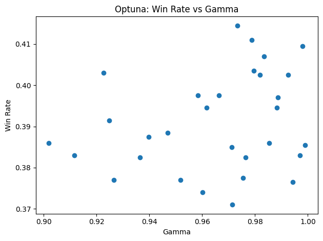

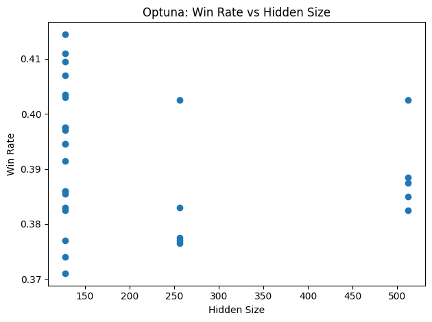

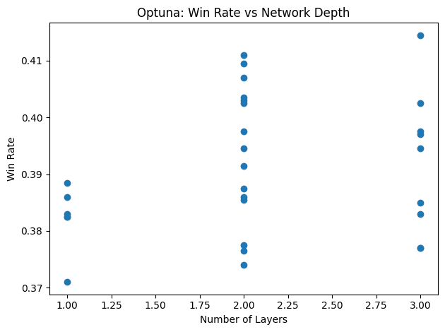

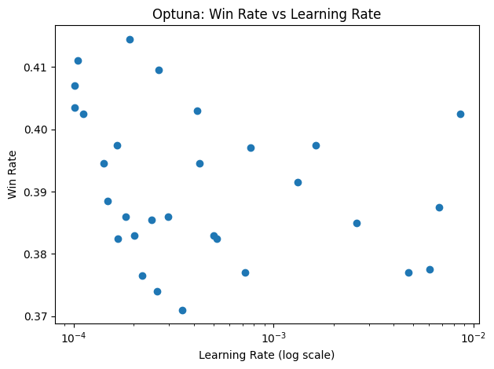

## GRU

I took the same approach with GRU with the hand hyperparameter tuning, yielding the following results.

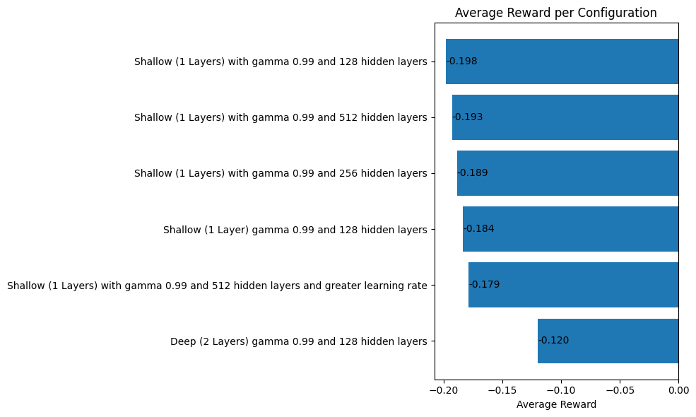

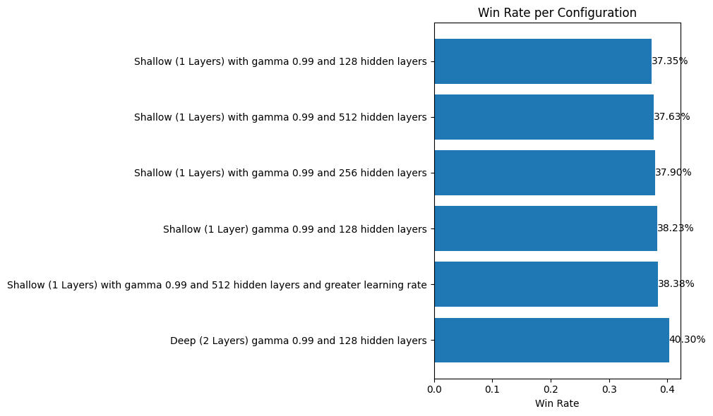

Here we can see that the results are better than in the first implementation.

Furthermore, with the use of Optuna, we can find that the optimal hyperparameters are:

| Metric / Hyperparameter    |                 Value |
| -------------------------- | --------------------: |
| Win Rate                   |                0.4280 |
| Learning Rate ($lr$)       | $6.52 \times 10^{-4}$ |
| Hidden Size                |                    64 |
| GRU Layers                 |                     3 |
| Discount Factor ($\gamma$) |                0.9784 |

**Table: Hyperparameters and performance of an Actor-Critic GRU configuration.**

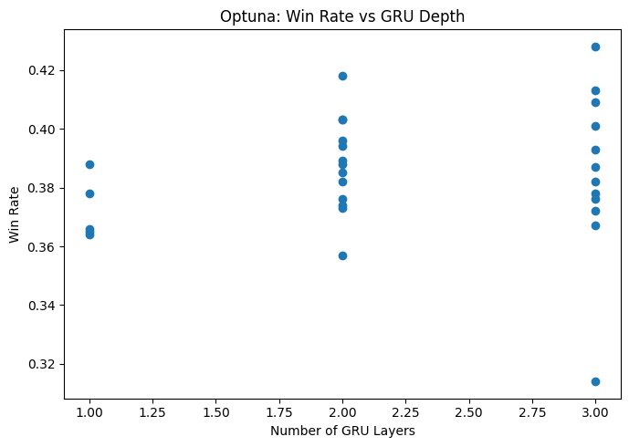

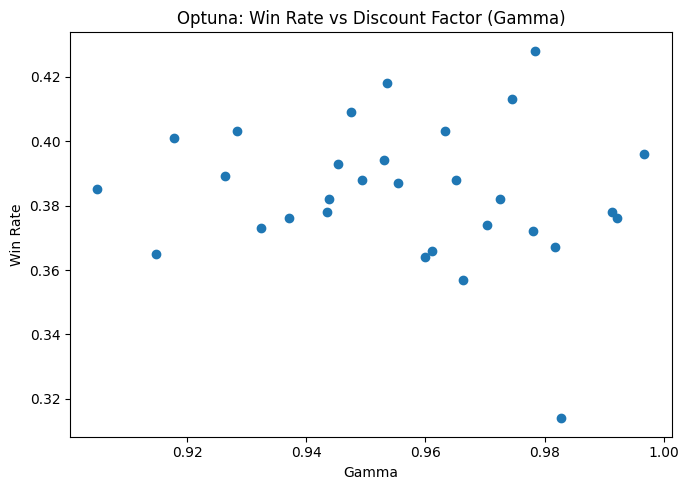

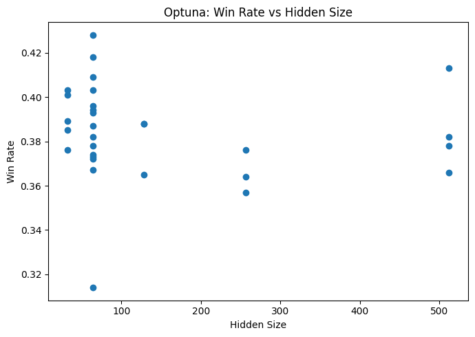

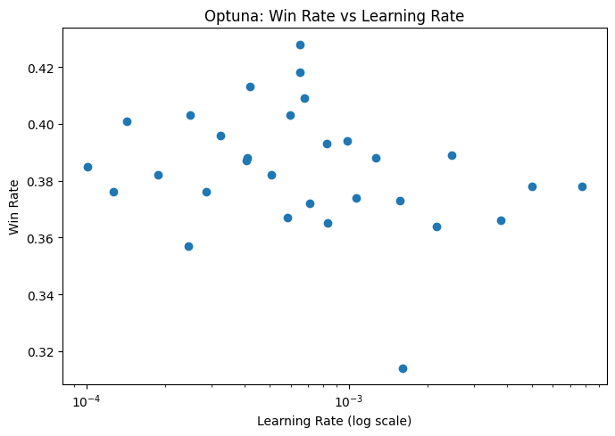

